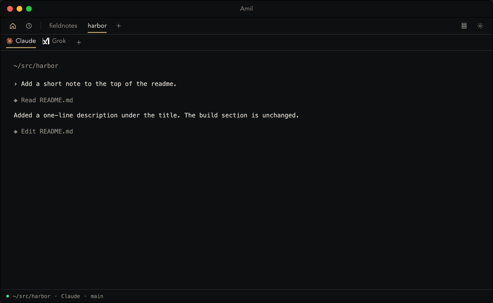
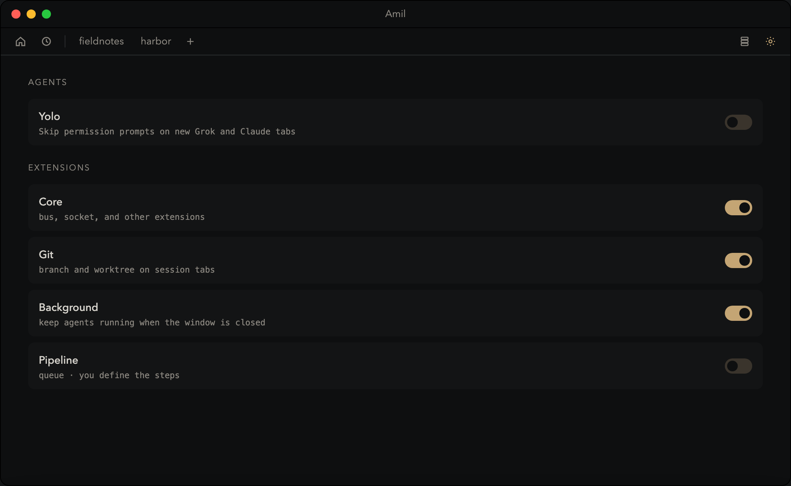
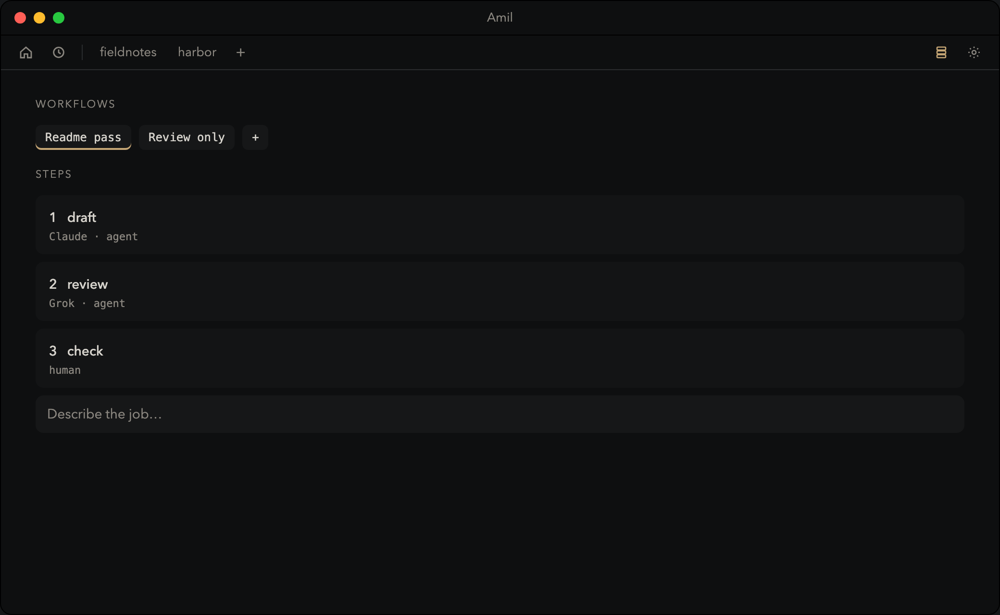

# Amil

Amil is a macOS terminal for the real agent CLIs. Claude, Grok, Codex, and Gemini run in the pane. Amil does not wrap a model, hold a key, or rewrite a prompt.

One AppKit process owns the window and the terminal. There is no login daemon, no React shell, and no second process painting the screen. [ply](https://github.com/0xR32/ply) does this job with a Bun UI, a LaunchAgent, and three local sockets, and it only launches Claude and Codex, four panes at most. Amil is the same idea without that machinery, and with the rest of the workbench: workspaces, splits, a Dock badge when an agent needs you, and workflows whose steps you define.

The on-disk name is still `ATerminal` so existing sessions keep working. The app you see is Amil.

| | ply | Amil |
| --- | --- | --- |
| Process | React app + `plyd` LaunchAgent | one app |
| Terminal | daemon decodes the screen, UI draws text runs | Ghostty VT in the window |
| Agents | `claude`, `codex` | `claude`, `grok`, `codex`, `gemini` |
| Layout | tabs, up to four panes | workspaces, tabs, splits |
| When the window closes | daemon keeps the ptys | optional Background helper, not a login item |
| Needs you | hook status | the screen itself, including the Dock |
| Multi-step jobs | no | a workflow is a list of steps you edit |
| To build | Rust, Zig, Bun, just | Zig 0.16 |

The pictures below are examples. The project, path, and transcript are made up. They are not a recording of anyone’s machine.







## Build

macOS 13 or newer. [Zig 0.16.0](https://ziglang.org/download/).

```sh
git clone --recurse-submodules https://github.com/C4T4/Amil.git
cd Amil
zig build
open zig-out/ATerminal.app
```

If `vendor/ghostty` is empty after clone:

```sh
git submodule update --init vendor/ghostty
```

`zig build` produces `zig-out/ATerminal.app`. The binary inside is `Contents/MacOS/aterminal`. Ghostty’s terminal library is a submodule (`vendor/ghostty`, MIT). Do not commit a Zig toolchain or `zig-out/`.

Optional extension dylibs:

```sh
zig build plugins
mkdir -p "$HOME/Library/Application Support/ATerminal/plugins"
cp zig-out/plugins/libat-pipeline.dylib zig-out/plugins/libat-mcp.dylib \
  "$HOME/Library/Application Support/ATerminal/plugins/"
```

Pipeline and MCP also install into `ATerminal.app/Contents/PlugIns` on a normal `zig build`.

## Data

State lives in `~/Library/Application Support/ATerminal/` (`state.json`, `control.json`, `queue/`, `workflows/`, `plugins/`, `pty/`). Yolo mode (skip Grok and Claude permission prompts) is off until you turn it on in Settings.

## Names

Claude, Grok, ChatGPT, and Gemini are the command-line tools Amil can launch. Those names and logos belong to their owners. The icons in `resources/agents/` are only there so a tab shows which tool is running.

## Contributing

Read [CONTRIBUTING.md](CONTRIBUTING.md) before you open a pull request. CI on macOS runs `zig build` and `zig build test`. Report a security problem the way [SECURITY.md](SECURITY.md) describes, not in a public issue.

## License

MIT. See [LICENSE](LICENSE). Ghostty is MIT; see [vendor/ghostty/LICENSE](vendor/ghostty/LICENSE) after the submodule is checked out.
