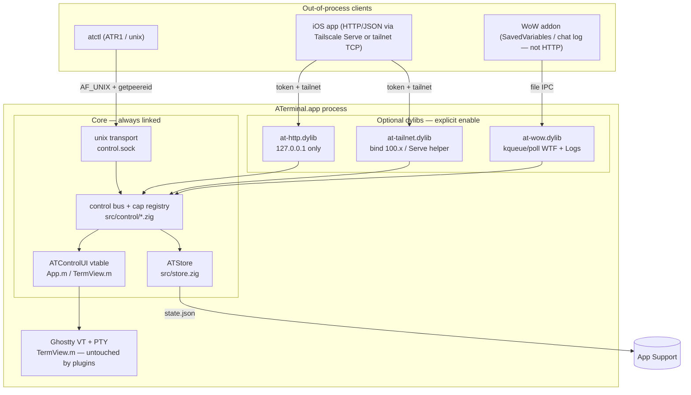
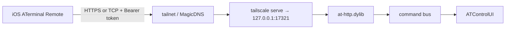

# ATerminal Control Plane: Plugin Bus & External Drivers

| Field | Value |
| --- | --- |
| **Title** | Control plane as core: in-process command bus, capability registry, optional transport plugins |
| **Author** | ATerminal |
| **Date** | 2026-09-20 (rev 3) |
| **Status** | Draft |
| **Product** | ATerminal (macOS AI-first terminal / agent workspace — not an editor or IDE) |
| **Repo** | `.` |

---

## Overview

ATerminal already has a complete in-process mutation API for workspaces, tabs, pane trees, and persistence (`src/store.zig` → `include/aterminal.h`) and a complete UI action surface (`ATWindowController` in `src/macos/App.m`, PTY I/O in `ATTermView`). What it lacks is a **stable, versioned way for code that is not AppKit to invoke those actions** — an iOS client on a Tailscale tailnet, a CLI, or a World of Warcraft addon.

This design adds a **tiny in-process command bus** in Zig as core, plus a **capability registry**. Everything that talks to the outside world is a **plugin**:

- **Unix socket transport** — cheap enough to ship in-process and on-by-default (one listen fd, GCD source on the main queue, `getpeereid` same-uid). Not a separate process.
- **HTTP loopback, Tailscale, WoW SavedVariables/chat-log** — optional dylibs, explicit enable, not linked into the default `aterminal` binary.

The app process **is** the server. If ATerminal is quit, clients cannot drive it. No daemon, no helper, no PTY pool, no extra thread storm. Plugins never import AppKit; they call named commands the UI already implements. JSON is allowed on this control plane only — never on the Ghostty render path.

---

## Background & Motivation

### Current state

| Layer | Where | What it already does |
| --- | --- | --- |
| State | `src/store.zig`, C ABI in `include/aterminal.h` | Workspaces, tabs, binary pane tree (max 8 leaves), history, home folder. Atomic `state.json` + `state.recovery.json` + `session.lock` under `~/Library/Application Support/ATerminal/`. |
| Agents | `include/at_agents.h`, `src/macos/Agents.m` | Catalog: claude / grok / chatgpt(codex) / gemini. |
| UI | `src/macos/App.m` (`ATWindowController`) | `selectWorkspace:`, `selectSession:`, `addSessionAgent:`, `splitHoriz:`, `closeSession` / `closeSessionIndex:`, `closeActive`, `createWorkspace:folders:agent:`, `openHistorySession:`, `reload`, `ensureTerm:…`, `activityForTabId:` / `activityForWorkspaceId:`. |
| PTY | `src/macos/TermView.m` | `forkpty`, Ghostty VT, `writeBytes:length:` (private), image paste via `.aterminal-paste` PNG + `insertPath:` (`@path` for `claude`). Master is `O_NONBLOCK`. Dispatch source on **main queue**. |
| Lifecycle | `ATAppDelegate` | `applicationDidFinishLaunching` → `at_store_open` + window; 2s flush timer; `applicationWillTerminate` → `at_store_close` (clears lock). |
| Build | `build.zig` | Root module is `src/store.zig` (`main` → `at_macos_main`). ObjC sources compiled in. Ghostty VT static. No plugin step. |

`at_store_*` is the source of truth. The UI is a renderer + PTY owner that **must** run after store mutations (`[self reload]` remounts the pane tree, `ensureTerm:` spawns/resumes). Any external control path that writes `state.json` behind the app's back, or that duplicates workspace/tab state, will desync PTYs and activity pips.

Today the only drivers are the mouse, the menu, and `handleNavEvent:`. That does not scale to an iPhone on the same tailnet or a `/at` slash command inside WoW Forever.

### Pain points

1. **No seam.** Store C ABI is in-process and index-based. There is no versioned, id-based, capability-checked RPC that out-of-process clients can speak.
2. **No auth story.** Binding a TCP port without pairing would expose agent PTYs (prompt injection, exfil of workspace paths) to anything on the interface.
3. **Size/RAM.** Agents already dominate RSS (Claude CLI ~191MB, Grok ~136MB; not re-measured this revision). Control must not add processes, warm binaries, or idle threads. Current `aterminal` is **13 024 680 bytes (~12.4MB) ReleaseFast arm64**, dominated by `ghostty-vt-static`, not our ~7k lines. Size gates measure **delta vs `main`**, Ghostty excluded from the denominator. Target: PR1+PR2 (bus + ATR1 + unix listen) ≪ 50KB; finished core through pairing/cmds still likely 50–80KB if JSON stays hand-rolled. ~0 idle RAM beyond one listen socket.
4. **WoW is not a TCP client.** Classic / Forever Lua cannot open sockets or HTTP. Pretending otherwise produces a plugin no addon can use.

### Constraints (must honor)

- Zig 0.16 + thin ObjC AppKit. Core/state stays in Zig; UI stays in `src/macos/*.m`.
- Hard nos: Electron, Tauri, SwiftUI, WKWebView, JSON on the **render** path, full assembly, own VT long-term.
- macOS-only v1 for the app. iOS / WoW / CLI are out-of-process consumers.
- Reuse store + TermView actions. **No parallel state machine.**
- Default launch must not listen on the network. TCP is opt-in.
- No daemon. No extra processes. No PTY pools / warm leaders / prefaulting as defaults.
- Do not add a file tree or editor.

---

## Goals & Non-Goals

### Goals

1. **In-process command bus + capability registry** in Zig, with a C ABI AppKit can register into and plugins can call.
2. **One framed RPC protocol** (`ATR1`) that unix, TCP, HTTP, CLI, iOS, and (via an adapter) WoW all bottom out on.
3. **Unix transport in the default binary**, same-uid, on-by-default if and only if it stays one `dispatch_source` on the main queue.
4. **Optional transport plugins** as dylibs, enabled by an explicit list. Default `zig build` does not link or ship them in `ATerminal.app`.
5. **First commands:** list workspaces/tabs/panes, focus, send text/keys to a pane PTY, paste path/PNG, activity (`none` / `standby` / `needs-input` / `working`), start/resume an agent tab, split/close pane, create/close workspace.
6. **Auth:** unix = `getpeereid` same uid. Anything else = pairing token in the app-support dir. No open relay, no Tailscale Funnel.
7. **Least privilege per plugin** — the host thunks `call` over that plugin’s mask; transports pass a per-connection `have` into `at_control_call_capped`. Granted = `plugin_mask ∩ token_record ∩ hello_request ∩ op.need`.
8. **Honest WoW path** a Classic/Forever addon can actually use (file watch), plus an HTTP loopback plugin for clients that *can* HTTP (iOS, `atctl`, tests).

### Non-goals (v1)

- Driving ATerminal when the app is quit (no launchd helper, no `open -a` from a daemon). A future opt-in helper plugin is out of scope.
- Embedding `tsnet` / Go / a userspace Tailscale node in-process (binary and RAM blow-up).
- JSON-RPC 2.0, gRPC, protobuf, Cap'n Proto, XPC, AppleScript, Accessibility-driver control as the protocol.
- Pane screenshot/snapshot (v2: `pane.snapshot` via `cacheDisplayInRect:` — not on the Ghostty render path, still not v1).
- Streaming PTY output to clients (that *is* the render path; do not subscribe to VT bytes).
- Plugin sandboxing (separate processes, Seatbelt profiles). A loaded dylib is in-process and trusted.
- Hardened Runtime + Library Validation. Today's binary is not entitled; runtime `dlopen` of user plugins works. Revisit when we notarize.
- Preferences window / SwiftUI settings. v1 config is `control.json` plus a one-shot pairing alert.
- Multi-window, multi-user, or remote-engine agent APIs (MCP, LLM HTTP). Agents remain CLI processes in the pane.
- Windows / Linux app ports.
- Compiling transports into the hot path “just in case.”

---

## Proposed Design

### Architecture



**Invariant:** there is one store, one window controller, one `_terms` dictionary of `ATTermView`. Plugins do not own PTYs, do not parse VT, and do not write `state.json` themselves.

### Process & thread model

```mermaid
sequenceDiagram
  participant C as Client
  participant T as Transport (unix/http/wow)
  participant G as GCD main queue
  participant B as Command bus
  participant S as ATStore
  participant U as ATWindowController / ATTermView

  C->>T: framed request
  Note over T,G: unix source already on main; no extra hop
  T->>B: at_bus_dispatch(op, args, have_caps)  [direct, same stack]
  B->>B: capability check (have ∩ op.need)
  alt read-only snapshot
    B->>S: extern at_store_* getters
    B-->>T: JSON result
  else mutation / PTY
    B->>S: extern at_store_* mutators
    B->>U: ATControlUI vtable (reload, writeControlBytes, focus, …)
    U->>U: existing methods (reload, ensureTerm, splitHoriz, …)
    B-->>T: JSON result
  end
  T-->>C: framed response (non-blocking write; drop events on EAGAIN)
```

Rules:

1. **`at_store_*` is main-thread only** (today it is already only called from AppKit). The bus does not change that. Control Zig talks to the store **only through the C ABI** (`extern fn at_store_*` matching `include/aterminal.h`). Never `@import("store.zig")` from `src/control/` — that would cycle with `store.zig`'s comptime import of `control.zig`.
2. **Unix listen + client fds** are `dispatch_source` objects on `dispatch_get_main_queue()`, same pattern as `ATTermView`'s PTY source (`TermView.m` ~680). Idle cost: one source, one fd. GCD will not keep a worker thread parked for an idle source.
3. **Plugins must not `pthread_create`.** They register fds with `ATControlIO.watch_fd` (App.m wraps `dispatch_source`). WoW file watch may use a 2s `dispatch_source` timer — one source, not a thread.
4. **Control PTY writes do not spin.** `pane.input` uses a new `-writeControlBytes:length:` that issues at most one `write(2)` and returns short/`would_block`. Existing `-writeBytes:length:` stays private and spinning for `keyDown:` / Ghostty `at_write_pty` — dropping a keystroke because the master was full for one loop is worse than a tiny spin. Cap control payload at 64KiB.
5. **No extra process.** `atctl` is a short-lived client. Plugins are `dlopen` into the app.
6. **No `dispatch_sync` onto main.** Sources already run on main. Plugin `host->call` is direct. Always-async would avoid vtable→plugin→call reentrancy but adds latency; v1 forbids plugins from calling the bus from inside a command handler, so direct dispatch is safe. HTTP/unix read handlers call the bus on the same stack.
7. **`layout_build` is a single scratch buffer** on `Store` (`layout_n` / `layout_id[32]` …). `workspace.list` must `layout_build` per tab and **copy** id/agent/session bytes before the next `layout_build`. Header already says returned pointers die on the next mutating call; `layout_build` counts as one.

#### Unix source contract (PR2 blockers)

These apply to the listen fd, every accepted client, and every fd passed to `watch_fd`:

1. **`O_NONBLOCK`** on listen and clients. `accept` / `read` / `write` treat `EAGAIN`/`EWOULDBLOCK` as “return to the runloop”. Never spin (do not reuse `writeBytes:`’s `EAGAIN` continue loop).
2. **`FD_CLOEXEC`** on listen, accepted, and plugin fds **before** `watch_fd`. Agent children `forkpty` (`TermView.m` `spawn`); without CLOEXEC a Claude/Grok PTY inherits the control socket. PR2 acceptance: `lsof -p <agent-pid>` must not list `control.sock`.
3. **`SO_NOSIGPIPE` (0x1022)** on every stream. Also `signal(SIGPIPE, SIG_IGN)` once in `at_control_start` (belt-and-suspenders). A `write` to a gone client otherwise terminates the process and orphans agents.
4. **Frame reassembly** is a per-connection state machine. Each source fire reads **at most 4KiB**, appends to a small buffer, parses zero or one complete frame, returns. Do not loop until `len` bytes arrive. Incomplete header waits. `len > 1MiB` → close. A second `req` while one is in flight → close (`bad_frame`).
5. **`dispatch_source_cancel` then close the fd in the cancel handler.** Never close-then-cancel (GCD use-after-close). **Fd ownership:** after a successful `watch_fd`, the IO glue owns the fd. `unwatch_fd` only `dispatch_source_cancel`s. The cancel handler `close`s. The original caller (`unix.zig` / plugin) **must not** `close` that fd — not after `unwatch_fd`, not on error paths after watch succeeded. Same for plugin fds. Listen fd that was never passed to `watch_fd` is still the creator’s to close.
6. **Event writes from the 0.12s pulse are non-blocking.** On `EAGAIN`, **drop the event** (do not stall Dock pips / activity dots). Clients poll `activity.get` if they miss an edge.
7. **Main-thread parse budget.** Reject a JSON body that cannot be handled within the same 5ms gate as `workspace.list`. Practical cap: `paste_png` decoded 512KiB is the largest v1 body; decode+writePNG must not spin. If a future HTTP-over-tailnet client is slow, that is the case that might later justify a dedicated I/O thread still marshaling `at_bus_dispatch` onto main — not v1 (see Alternatives).
8. **Idle slots.** A client that has not completed `hello` within **60s** is closed. After hello, **no idle timeout in v1** (`subscribe` is long-lived). Hard cap remains 8 connections.

### File layout (new)

```
include/aterminal.h          — unchanged store ABI (small additive helpers OK)
include/at_control.h         — bus + UI vtable + IO glue + plugin host C ABI
include/at_plugin.h          — plugin-facing subset (ABI version 1)

src/json.zig                 — extracted scanner + bool() + jsonEscape/unescapeAlloc
src/store.zig                — store; comptime import control so exports link
src/control.zig              — barrel: start/stop, load plugins
src/control/bus.zig          — registry, dispatch(have), cap check
src/control/rpc.zig          — per-message schema parsers (hello, req, res) on the scanner
src/control/frame.zig        — ATR1 codec + per-conn reassembly state machine
src/control/unix.zig         — AF_UNIX transport (default binary)
src/control/auth.zig         — pairing tokens, peer cred
src/control/cmds.zig         — built-in ops via extern at_store_* only

src/plugins/http.zig         — dynamic library target at-http
src/plugins/tailnet.zig      — dynamic library target at-tailnet
src/plugins/wow.zig          — dynamic library target at-wow

src/atctl.zig                — optional CLI executable, not installed into .app

plugins/wow/ATerminalControl/  — example addon (toc + lua), not in the app binary
```

`build.zig` today sets the exe `root_module`’s `root_source_file = src/store.zig`. Keep that (minimize churn): `store.zig` gains

```zig
comptime {
    _ = @import("control.zig");
}
```

so `export fn at_control_*` land in the executable. **Control never `@import`s `store.zig`.** `cmds.zig` uses `extern fn at_store_workspace_count(...) callconv(.c) u32;` (and the rest of `aterminal.h`). A new `src/root.zig` that imports both is cleaner long-term and is **not** v1 (churn). Do **not** make `src/control.zig` pull AppKit.

Plugin dylibs are **separate** `b.addLibrary(.{ .linkage = .dynamic, ... })` targets (Zig 0.16 has **no** `addSharedLibrary`), installed under `zig-out/plugins/`, **not** copied into `ATerminal.app` by the default install step. `atctl` uses a `root_module` the same way the app exe does — not the removed `.root_source_file` executable shorthand.

### Command bus

Zig side (`src/control/bus.zig`). `Cap` is a `packed struct(u32)` **LSB-first**, matching these C bits (v1 plugins are Zig-only and should use the header, not a Zig packed struct across `dlopen`):

```c
#define AT_CAP_READ    (1u << 0)
#define AT_CAP_FOCUS   (1u << 1)
#define AT_CAP_INPUT   (1u << 2)
#define AT_CAP_SESSION (1u << 3)
#define AT_CAP_LAYOUT  (1u << 4)
#define AT_CAP_FS      (1u << 5)
#define AT_CAP_ADMIN   (1u << 6)  /* load/unload plugin only */
#define AT_CAP_PAIR    (1u << 7)  /* core.pair / core.revoke only */
```

```zig
pub const Cap = packed struct(u32) {
    read: bool = false,
    focus: bool = false,
    input: bool = false,
    session: bool = false,
    layout: bool = false,
    fs: bool = false,
    admin: bool = false,
    pair: bool = false,
    _pad: u24 = 0,
};

pub const BusError = error{ UnknownOp, Denied, BadArgs, NotFound, NotReady, WouldBlock, Unavailable, Internal };

pub const Handler = *const fn (ctx: *anyopaque, args: []const u8, out: *std.ArrayList(u8)) BusError!void;

pub fn register(name: []const u8, need: Cap, ctx: *anyopaque, handler: Handler) !void
pub fn dispatch(name: []const u8, args: []const u8, have: Cap, out: *std.ArrayList(u8)) BusError!void
```

Registry is a **fixed array of 64** entries (no hashmap growth on the hot path). Linear scan by name. Names are dotted ASCII, max 32 bytes (`workspace.list`). Unknown op → `UnknownOp`. `dispatch` computes `have ∩ need`; missing bits → `Denied`.

C ABI (`include/at_control.h`):

```c
#define AT_CONTROL_ABI 1

/* Window/PTY actions. GCD does not live here. */
typedef struct ATControlUI {
    void *ctx;
    /* All callbacks run on the main thread. Return 0 or -1; details via at_store_error / at_control_error.
       pane_*_activity: 0..3 is ATActivity (0 = ATActivityNone is a valid snapshot, not an error).
       Return -1 only when the id is unknown. */
    int  (*reload)(void *ctx);
    int  (*focus_workspace)(void *ctx, const char *workspace_id);
    int  (*focus_tab)(void *ctx, const char *workspace_id, const char *tab_id);
    int  (*focus_pane)(void *ctx, const char *pane_id, int make_key);
    int  (*pane_write)(void *ctx, const char *pane_id, const void *bytes, size_t n, int submit);
    int  (*pane_paste_path)(void *ctx, const char *pane_id, const char *path);
    int  (*pane_paste_png)(void *ctx, const char *pane_id, const void *png, size_t n);
    int  (*pane_activity)(void *ctx, const char *pane_id);
    int  (*tab_activity)(void *ctx, const char *tab_id);
    int  (*workspace_activity)(void *ctx, const char *workspace_id);
    /* On success, caller reads the new ids from the store (add_* append and set active).
       Must NOT present NSAlert — map at_store_error to the RPC error. */
    int  (*tab_add)(void *ctx, const char *workspace_id, const char *agent, const char *session /*nullable*/);
    int  (*tab_close)(void *ctx, const char *workspace_id, const char *tab_id);
    int  (*pane_close)(void *ctx, const char *pane_id);
    int  (*pane_split)(void *ctx, const char *workspace_id, const char *tab_id, int horiz);
    int  (*workspace_create)(void *ctx, const char *name, const char *const *folders, uint32_t n, const char *agent);
    int  (*workspace_close)(void *ctx, const char *workspace_id);
} ATControlUI;

/* GCD glue owned by App.m, used by unix.zig and by plugins via the host thunk.
   After watch_fd returns 0, IO owns fd: unwatch_fd only dispatch_source_cancel;
   the cancel handler close(2)s. Caller must not close a watched fd. */
typedef struct ATControlIO {
    void *ctx;
    int  (*watch_fd)(void *ctx, int fd, void (*on_read)(int, void *), void *user);
    int  (*unwatch_fd)(void *ctx, int fd);
} ATControlIO;

int  at_control_start(ATStore *store, const ATControlUI *ui, const ATControlIO *io);
void at_control_stop(void);

/* Uncapped. App.m / tests only (TCB). Plugins must not dlsym this. */
int  at_control_call(const char *op, const char *json_args, char **json_out);

/* Transports: have is the connection's granted mask. Final = have ∩ op.need.
   Plugin host->call is a thunk that calls this with (plugin_mask ∩ conn_have). */
int  at_control_call_capped(const char *op, const char *json_args, char **json_out, uint32_t have);

void at_control_free(char *p);
const char *at_control_error(void);

/* Main thread. No-op if no subscribers. Pulse in App.m calls this with an activity-edge JSON object. */
void at_control_emit(const char *json_event);
```

`at_control_start` is called from `-[ATAppDelegate applicationDidFinishLaunching:]` **after** `at_store_open` and **after** `ATWindowController` exists (so the vtable `ctx` is valid). `at_control_stop` from `applicationWillTerminate` **before** `at_store_close`.

**Cap composition (every remote/plugin call):**

```
granted = plugin_mask ∩ token_record ∩ hello_request ∩ op.need
```

- Unix: `plugin_mask` = all bits (in-process); `token_record` = all; `hello_request` as sent; default unix grant if hello omits caps = `READ|FOCUS|INPUT|SESSION|LAYOUT|FS|PAIR` (**not** `ADMIN`).
- HTTP plugin: `plugin_mask` = `READ|FOCUS|INPUT|SESSION|LAYOUT|FS` (no admin, no pair — pairing is unix-only); `token_record` from `pairing.json`; `hello_request` from the Bearer client’s first `/v1/hello` body (or all of token_record if omitted).
- Wow plugin: `plugin_mask` = `READ|FOCUS|INPUT|SESSION|LAYOUT` (no fs, no admin, no pair). `host->call` is closed over that mask; a wow-mask `pane.paste_path` returns `denied`. Test that.

`host->call(op, args, out)` **does not take a mask** because it is a thunk the loader closes over `plugin_mask`. HTTP adds `host->call_capped(..., conn_have)` for the token intersection. Plugins **must not** `dlsym("at_control_call")` on the main binary.

Built-in commands that only need the store (list ids, history) are registered by Zig via `extern at_store_*`. Commands that need a live `ATTermView` go through `ATControlUI`. App.m fills the vtable; it does not grow a second controller.

### Protocol: ATR1

Length-prefixed, little-endian, binary-friendly, JSON payload (control plane only).

```
offset  size  field
0       4     magic  'A' 'T' 'R' '1'
4       1     type   1=hello  2=hello-ok  3=req  4=res  5=event  6=error
5       1     flags  bit0 = payload is JSON UTF-8 (v1: always set)
6       2     proto  u16le, currently 1
8       4     id     u32le  (correlation; 0 for events)
12      4     len    u32le  payload bytes
16      len   payload
```

- Max `len`: **1 MiB**. Larger → close the connection. `pane.input` text capped at **64KiB**; `paste_png` at **512KiB** **decoded**.
- **PNG in JSON:** `pane.paste_png` args carry `png_b64` (standard base64 of the PNG bytes). v1 flags bit0 is always set; there is no binary payload type in v1. 512KiB decoded ≈ 683KiB base64, under the 1MiB frame cap.
- One request in flight per connection in v1 (simplifies WoW/iOS). A second `req` before the `res` → close. Pipelining is a v2 flag.
- JSON is a single object. No JSON-RPC envelope wrapping; `op` lives in the payload.
- **Decoding:** `src/json.zig` is the store scanner plus `bool()` (`true`/`false`). It is **not** a generic DOM. `src/control/rpc.zig` has explicit schema parsers for `hello`, `req` (string `op` + object `args`), `res`, and per-op `args` (`submit` bool, `text` string, `png_b64`, string arrays). Unknown keys in `args` are `skipValue`’d.

**hello** (`type=1`):

```json
{"client":"atctl","client_ver":1,"token":"","caps":["read","focus","input","session","layout","fs","pair"]}
```

**hello-ok** (`type=2`):

```json
{
  "server":"aterminal",
  "proto":1,
  "pid":12345,
  "support_dir":"~/Library/Application Support/ATerminal",
  "caps":["read","focus","input","session","layout","fs","pair"],
  "ops":["core.ping","core.pair","workspace.list","workspace.focus","pane.input"]
}
```

`support_dir` is the app-support path (includes the home directory). Any authed client learns it; that is accepted for v1 (same-uid unix already knows; remote tokens are owner-minted).

Unix: `token` must be empty (non-empty → `bad_auth`). `getpeereid` same-uid. Granted = hello `caps` ∩ unix-default (`READ|FOCUS|INPUT|SESSION|LAYOUT|FS|PAIR`). **`ADMIN` is never granted on unix** — do not inspect `LOCAL_PEERPID` via `proc_pidpath` (TOCTOU / symlink). Pairing uses `PAIR`, not `ADMIN`. Remote: token required; granted = `token_record ∩ hello_request ∩ plugin_mask`.

**req** (`type=3`):

```json
{"op":"pane.input","args":{"pane":"a1b2c3d4","text":"ship it","submit":true}}
```

**res** (`type=4`):

```json
{"ok":true,"result":{"wrote":8}}
```

or

```json
{"ok":false,"error":{"code":"not_ready","message":"pane PTY not spawned"}}
```

Error codes (stable): `bad_frame`, `bad_auth`, `denied`, `unknown_op`, `bad_args`, `not_found`, `not_ready`, `would_block`, `unavailable` (app quitting / plugin missing), `internal`.

**event** (`type=5`), unix/TCP streams only:

```json
{"event":"activity","pane":"a1b2c3d4","tab":"…","workspace":"…","state":"needs-input"}
```

Emitted on **edge only** (state change). The 0.12s pulse in `ATWindowController` (`refreshDockBadge` / `activityNeedsPaint`) diffs and calls `at_control_emit` (main thread; no-op if no subscribers). Do not stream VT. HTTP transport does not do events; clients poll `activity.get`. Event writes are non-blocking; `EAGAIN` drops the event.

### First commands

All identifiers are the existing 8-hex `makeId()` strings (`store.zig` `makeId`), **never indices**. Indices shift; ids do not.

| op | cap | Implementation |
| --- | --- | --- |
| `core.ping` | — | `{"pid":…,"uptime_ms":…,"clients":n}` |
| `core.caps` | — | echo granted caps + ops |
| `core.pair` | pair | Mint a token. Args `{name, caps?}`. Default if `caps` omitted = `READ\|FOCUS\|INPUT\|SESSION\|LAYOUT\|FS`. Always mask off `PAIR` and `ADMIN` (a token must not mint further tokens or load plugins). Requested `caps` is intersected with that default. Result `{id,token,caps}` — **token plaintext once**. Writes hash to `pairing.json`. Unix only. |
| `core.revoke` | pair | Args `{id}`. Deletes the pairing record. |
| `core.plugin_load` / `core.plugin_unload` | admin | Not granted to unix/http/wow in v1. Listed so the cap is not a ghost. No `atctl` subcommand. |
| `workspace.list` | read | Walk `at_store_workspace_count` / `id` / `name` / `agent` / folders / tabs. Per tab: `layout_build` then **copy** leaf id/agent/session before the next tab. Activity via UI vtable. |
| `workspace.focus` | focus | Resolve id → **index**, then `-[ATWindowController selectWorkspace:]` (`NSNumber` index, never pass the id string into that selector). |
| `workspace.create` | session | `at_store_add_workspace` via a vtable that **must not** `NSAlert` (unlike `makeWorkspace:` at `App.m` ~2001). `add_workspace` appends and sets `active`. Result `{"id":"…","tab":"…","pane":"…"}` by reading the new last workspace / tab 0 / first leaf. Then `reload`. |
| `workspace.close` | session | **Do not wrap `closeActive`.** That looks up `_terms[workspace_id]` (keys are pane ids) and leaks agent PTYs (`App.m` ~1976). Vtable walks every tab, `layout_build` each, `killChild`+remove every leaf in `_terms`, then `at_store_remove_workspace`. Fixing `closeActive` itself is in PR4 scope so the UI and RPC share the walk. |
| `tab.list` | read | Subset of the snapshot. |
| `tab.focus` | focus | Resolve tab id → workspace index. Set `_page = ATPageWorkspace` the same way `selectWorkspace:` does (`App.m` ~1232), then `at_store_set_active` + `at_store_set_active_tab` + `reload`. A `reload` while `_page` is Quickstart/History returns before mounting terms (`App.m` ~2072–2100) — skipping the page switch is a no-op from History. |
| `tab.add` | session | Reject unknown agent ids (`at_agent_find` on a **non-empty** id; empty/`NULL` currently defaults to claude — do not rely on that). Id is `chatgpt`, **not** cmd `codex`. `at_store_add_tab` then optional `at_store_set_tab_session` **before** `reload` so `ensureTerm:…resume:` (`App.m` ~1126) works. `add_tab` sets that workspace’s `active_tab` but does **not** focus the workspace; `reload` only mounts the **active** workspace. Result `{"id":"…","pane":"…","spawned":false}` unless that workspace was already focused and `ptyReady`. `pane.input` on a background add returns `not_ready` until `workspace.focus`. |
| `tab.close` | session | Resolve tab id → index. If it is the last tab, return `denied` (`"last tab; close the workspace instead"`) — do **not** fall through to `closeActive` the way `closeSessionIndex:` does (`App.m` ~1873). Otherwise `killChild` all leaves of that tab (same loop as `closeSessionIndex:`) then `at_store_remove_tab`. |
| `pane.list` | read | `layout_build` + copied leaf ids. |
| `pane.focus` | focus | Resolve pane id → (workspace, tab) (same scan as `pane.close` / optional `at_store_find_pane`). Then the `tab.focus` path (page + workspace + tab + `reload`) and `at_store_set_active_pane` + `makeFirstResponder:` on that pane. Do **not** only `makeFirstResponder:` on the currently mounted tab — a pane in a background workspace would miss `_terms` / `_page`. Unknown pane → `not_found`. |
| `pane.split` | layout | `at_store_split` + `reload`. `horiz: true` = Split Down. Result includes the new pane id (`split` sets `active_pane` to the new leaf). |
| `pane.close` | layout | **Id-based.** Do not wrap `closeSession` (that closes the **active** pane of the **active** tab). Resolve pane id → (workspace, tab) by scanning layouts (optional `at_store_find_pane`). Then `at_store_close_pane` + `killChild` on **that** pane. Last pane in the tab → `denied` (`"last pane"`), matching the store (`at_store_close_pane` already returns -1). |
| `pane.input` | input | Vtable `pane_write` → `-writeControlBytes:length:` (one `write(2)`, no spin). Args: `pane`, `text`, `submit` (append `\r` + `noteSubmit`). Optional `ensure:true` focuses workspace/tab then retries once. `not_ready` if still `_master < 0`. `would_block` on short write. |
| `pane.keys` | input | Named keys only: `enter`, `tab`, `escape`, `backspace`, `up/down/left/right`, `ctrl-c/d/z/l`. Same sequences as `keyDown:` (`TermView.m` ~1094). Via `writeControlBytes:`. |
| `pane.paste_text` | input | Same as input without submit. No bracketed paste in v1. |
| `pane.paste_path` | fs | Existing `insertPath:` (`@` prefix if `command == claude`). |
| `pane.paste_png` | fs | Args `png_b64`. Decode ≤512KiB, `writePNG:` into `.aterminal-paste`, `insertPath:`. |
| `activity.get` | read | `{pane,tab,workspace}` → `"none"\|"standby"\|"needs-input"\|"working"`. `none` is valid (no process). |
| `subscribe` | read | `{events:["activity"]}`. Unix/TCP only. |
| `agent.list` | read | `at_agent_count` / `at_agent_at`. |
| `history.list` | read | `at_store_history_*` (cap 200). |

`workspace.list` result shape (illustrative):

```json
{
  "home": ".",
  "page": "workspace",
  "active_workspace": "3f2a91c0",
  "workspaces": [
    {
      "id": "3f2a91c0",
      "name": "ATerminal",
      "agent": "claude",
      "folders": ["."],
      "activity": "working",
      "active_tab": "9ab10e22",
      "tabs": [
        {
          "id": "9ab10e22",
          "name": "",
          "agent": "claude",
          "session": "3f2a91c0-…",
          "activity": "needs-input",
          "active_pane": "9ab10e22",
          "panes": [
            {"id": "9ab10e22", "agent": "claude", "session": "…", "activity": "needs-input"}
          ]
        }
      ]
    }
  ]
}
```

`page` mirrors `ATPage` (`workspace` / `quickstart` / `history`) so a client knows whether the stage is visible. Focusing a workspace sets `_page = ATPageWorkspace` the same way `selectWorkspace:` does.

**Deferred spawn.** `ATTermView spawnIfReady` refuses until the view is in a window, has a superview, and bounds are ≥ 80×40 (`TermView.m` ~501). `pane.input` against a never-shown pane returns `not_ready`. `ensure:true` runs focus+`reload` then retries once; if still unspawned, the client retries. Do not `forkpty` from the control path at 800×480 — that is the latency bug we already fixed.

### Unix transport (default binary)

- Path: `~/Library/Application Support/ATerminal/control/control.sock`
- Directory mode **0700**, socket **0600**. Do **not** chmod the whole support dir (today `supportDir()` mkdir is `0755` and `state.json` is `0644`).
- `SOCK_STREAM`. `listen(8)`. Hard cap **8** connected clients; further accepts are closed immediately.
- After `accept`: `FD_CLOEXEC`, `O_NONBLOCK`, `SO_NOSIGPIPE`, then `getpeereid(fd, &uid, &gid)` (macOS; **not** Linux `SO_PEERCRED`). Reject if `uid != getuid()`. `getsockopt(SOL_LOCAL, LOCAL_PEERPID)` for logs only — not for granting `ADMIN`.
- **Socket ownership (do not use `session.lock`).** `at_store_open` *always* overwrites `session.lock` with the current pid and has no flock (`writeLock` in `store.zig`). By the time `at_control_start` runs the lock pid is always us, so a second `ATerminal.app` would steal the first instance’s socket. Recipe:

  1. `socket` + `FD_CLOEXEC`.
  2. `connect()` to the existing path.
  3. If `connect` **succeeds**, another live server owns it → close the probe fd, **do not unlink**, skip unix (app keeps running without control).
  4. If `connect` **fails**, `unlink` the path, `bind`, `listen`, `chmod 0600`.
  5. `at_control_stop` unlinks **our** bound path only.

- Listen fd: `O_NONBLOCK` + `FD_CLOEXEC` + `SO_NOSIGPIPE` as in the Unix source contract. `signal(SIGPIPE, SIG_IGN)` once at start.
- `atctl` is the first client: `src/atctl.zig`, `zig-out/bin/atctl`, not inside the `.app`.

Default on. Kill switches, env wins:

1. `ATERMINAL_CONTROL=0` — no unix, no plugins.
2. `control.json` `"unix": false` — no unix; plugins still load if listed.

Missing `control.json` = unix on, plugins empty.

### Config

New file, same directory as `state.json`, mode 0600, parsed with the shared JSON scanner. **Unknown keys ignored** (same as store). Not merged into `state.json` (control must be editable while the app is running without fighting workspace autosave).

```json
{
  "unix": true,
  "max_clients": 8,
  "plugins": [],
  "http": { "bind": "127.0.0.1", "port": 17321 },
  "tailnet": { "port": 17321, "serve": true },
  "wow": {
    "client": "/Applications/World of Warcraft/_classic_beta_",
    "wtf": "/Applications/World of Warcraft/_classic_beta_/WTF",
    "chatlog": false
  }
}
```

`plugins` is an array of **stems** (`"http"`, `"wow"`, `"tailnet"`). Core maps stem → `~/Library/Application Support/ATerminal/plugins/libat-http.dylib` (then `zig-out/plugins/` is only a build output; the user copies). **No auto-scan of the directory** — that would load surprise dylibs.

### Plugin ABI

`include/at_plugin.h`:

```c
#define AT_PLUGIN_ABI 1

typedef struct ATPluginHost {
    uint32_t abi;
    uint32_t caps;                 /* plugin_mask; informational. call() is already thunked to it. */
    const char *support_dir;       /* valid until at_plugin_shutdown */
    const char *config_json;       /* whole control.json; valid until shutdown; plugin parses its own key */
    /* Closed over plugin_mask. Equivalent to at_control_call_capped(..., plugin_mask). */
    int  (*call)(const char *op, const char *json_args, char **json_out);
    /* Closed over plugin_mask ∩ have. HTTP uses this with the token's caps. */
    int  (*call_capped)(const char *op, const char *json_args, char **json_out, uint32_t have);
    void (*free)(char *p);
    /* After watch_fd returns 0, host owns fd (same contract as ATControlIO). */
    int  (*watch_fd)(int fd, void (*on_read)(int fd, void *ctx), void *ctx);
    int  (*unwatch_fd)(int fd); /* cancel only; do not close */
    int  (*log)(int level, const char *msg);  /* 0=err 1=info 2=debug; fprintf only */
} ATPluginHost;

/* exported by the dylib — C ABI only, callconv(.c). No Zig slices / ArrayList across dlopen. */
int  at_plugin_abi(void);                 /* return AT_PLUGIN_ABI */
const char *at_plugin_name(void);         /* "http" / "wow" / "tailnet" */
int  at_plugin_init(ATPluginHost *host);
void at_plugin_shutdown(void);
```

Load (`src/control.zig`):

1. **`std.c.dlopen(path, .{ .NOW = true, .LOCAL = true })`**. Do **not** use `std.DynLib.open` — on this 0.16 stdlib it is `dlopen(..., LAZY)` only (`std/dynamic_library.zig` `DlDynLib.openZ`).
2. `at_plugin_abi()` must equal `AT_PLUGIN_ABI`.
3. Build the host: `caps` from a static table (`http`/`tailnet` → `READ|FOCUS|INPUT|SESSION|LAYOUT|FS`; `wow` → same minus `FS`). `call` / `call_capped` thunks close over that mask. `support_dir` / `config_json` pointers remain valid until `at_plugin_shutdown`.
4. `at_plugin_init`. Failure → `dlclose`, skip, do not abort the app.
5. Terminate: `at_plugin_shutdown` then `dlclose`.

**C-only dylib contract.** v1 plugins are Zig compiled to a C ABI dylib. No Zig types across the boundary. Plugins **return errors, never `@panic` on bad input** — a Zig panic aborts the whole app. Plugins **must not** link AppKit, Ghostty, or `store.zig`, and **must not** `dlsym` `at_control_call` on the main binary. They may link libc. HTTP plugin is a few hundred lines of Zig. WoW plugin is a Lua-table subset scanner, not a Lua VM. Compile-time `-Dplugin-http` remains an escape hatch if notarization breaks `dlopen`; not the default.

### HTTP loopback plugin (`at-http`)

Opt-in. Binds **`127.0.0.1` only** (not `::`, not `0.0.0.0`). Default port **17321** (unprivileged, not a common browser port). macOS local-network privacy may still dialog; that is acceptable for an explicit plugin.

Tiny HTTP/1.1 subset:

- `POST /v1/rpc` — body is the **req JSON** (`{"op":"…","args":{…}}`). Response is the **res JSON**. Auth: `Authorization: Bearer <token>`. Handler calls `host->call_capped(op, args, out, token_caps)` — never uncapped `at_control_call`.
- `GET /v1/hello` — `hello-ok` JSON. Auth required. Advertises `token_record ∩ plugin_mask`.
- No keep-alive pipelining beyond one request per connection in v1 (`Connection: close` is fine). No chunked encoding. No HTTP/2. `Content-Length` required. Max body 1MiB. Same CLOEXEC / NOSIGPIPE / O_NONBLOCK / cancel-then-close contract as unix.

This is the surface iOS `URLSession` and a hypothetical future WoW HTTP API would use. **Classic/Forever Lua cannot call it.** Shipping it does not make a WoW addon work.

Token is mandatory even on loopback (defense in depth against other local processes). Unix remains the zero-token local path for `atctl`.

### Tailscale / iOS

**Do not embed tsnet.** A Go userspace Tailscale node is multiple MB and a second identity; it violates the size/RAM budget and the “no extra process *as a default*” rule in spirit even if it is in-process.

v1 tailnet recipe (two layers):

1. Enable `http` plugin (127.0.0.1:17321).
2. User runs **Tailscale Serve** on the Mac (already installed for this user):

```bash
tailscale serve --bg --tcp 17321 tcp://127.0.0.1:17321
```

iOS then connects to `machine-name.<tailnet>.ts.net:17321` (or `https://machine-name.<tailnet>.ts.net` if Serve HTTPS is used in front of an HTTP plugin path). Traffic stays on the tailnet. **Funnel is forbidden** (public internet relay). Document this in the pairing alert.

Optional `at-tailnet` dylib (still opt-in): enumerate the Tailscale IPv4 (`100.x`) via `getifaddrs` (interface names `utun*` with a `100.64/10` address, or `tailscale0`) and `bind()` that address only. Same ATR1-over-TCP or the same HTTP parser. Still requires the pairing token — tailnet membership is not auth for agent PTYs (shared tailnets, tagged nodes, kids' iPads).



iOS app is **out of repo for v1**. This design only guarantees: same ops, HTTP/JSON encoding, pairing token, no render frames.

### World of Warcraft: honest limits and a transport that works

**Classic, Classic Era, Cataclysm, and WoW Forever (`_classic_beta_`) Lua cannot:**

- open TCP/UDP sockets
- make HTTP(S) requests (`SendHTTPRequest` does not exist)
- read or write arbitrary files
- talk to localhost

Addon communication (`C_ChatInfo.SendAddonMessage`) goes through **Blizzard's chat servers**, not the LAN. SavedVariables are loaded once at addon load and **written on logout / `/reload` only**. That flush-on-reload rule is intentional (anti-bot). Community reports (2026-09) also describe a Forever **cold-start SavedVariables load miss**; this design does **not** depend on that report being true. Treat the file as a one-way queue with monotonic ids either way; never require a round-trip the game must load back.

**Therefore `at-http` is not a WoW addon transport.** The plugin a Forever addon can actually talk to is **file IPC that ATerminal watches**.

#### `at-wow` plugin (opt-in)

Default client root: `control.json` `wow.client` = `/Applications/World of Warcraft/_classic_beta_`. WTF = `wow.wtf` or `{client}/WTF`. Chat log (unimplemented in PR7) would be `{client}/Logs/WoWChatLog.txt` — **client root, not WTF**.

Watch, via 2s GCD timer (kqueue VNODE is a later optimization):

```
<WTF>/Account/<account>/SavedVariables/ATerminalControl.lua
<WTF>/Account/<account>/<realm>/<char>/SavedVariables/ATerminalControl.lua
```

Parse a **Lua table subset** (string keys, strings, numbers, nested tables, `--` comments). Not a Lua VM.

Addon writes (account-wide SV):

```lua
ATControlDB = {
  ["seq"] = 4,
  ["queue"] = {
    { ["id"] = 3, ["op"] = "pane.input", ["text"] = "what does this debuff do", ["submit"] = 1 },
    { ["id"] = 4, ["op"] = "activity.get" },
  },
}
```

Plugin persists `~/Library/Application Support/ATerminal/wow.cursor` = last executed `id`. On each fire it executes **new ids only**, in order, through `host->call` (wow mask: no `fs`/`admin`/`pair`). Re-running after a duplicate `/reload` is a no-op. A wow-mask `pane.paste_path` must return `denied` (PR7 test).

**Responses cannot enter a live UI.** The addon, on `ADDON_LOADED`, reads **its own SV only**. v1 does **not** write `wow-out.lua` / `ATerminalControl.out.lua` — those files are invisible in-game, so they are dead weight unless a Mac user greps them. If debugging is needed, `ATERMINAL_CONTROL_DEBUG=1` logs op + id + error code (not prompt text). Live round-trip in-game **does not exist** on a stock client.

Practical v1 UX:

| Path | Latency | How |
| --- | --- | --- |
| Slash `/at …` then **`/reload`** | One reload | SV flush → plugin executes. Fine for “queue this prompt for the agent”. |
| Slash `/at …` **without** reload | **Does not leave the process.** | Be honest in the addon’s print: `queued — /reload to send`. |
| Optional `chatlog: true` | Live | Unimplemented in PR7. Would tail `{wow.client}/Logs/WoWChatLog.txt` after `LoggingChat(true)` + self-whisper prefix `AT>`. Noisy. Default **off**. |
| HTTP from Lua | **Impossible** on Forever/Classic | Do not ship a Lua `http.Post` that calls `SendHTTPRequest`. |

Example addon (repo `plugins/wow/ATerminalControl/`, not loaded by the Mac app):

```
## Interface: 11507, 110007, 120000
## Title: ATerminal Control
## SavedVariables: ATControlDB
```

`Interface` is a **documented unknown**: 11507 is Classic Era; Forever beta has reported other `WOW_PROJECT_ID` / interface numbers. Ship a comma-list and, before merge, read the `.toc` of any addon that actually loads in this user’s `_classic_beta_` `Interface/AddOns` and add that number. Do not treat 11507 as verified for Forever.

```lua
SLASH_AT1 = "/at"
SlashCmdList["AT"] = function(msg)
  ATControlDB = ATControlDB or { seq = 0, queue = {} }
  ATControlDB.seq = (ATControlDB.seq or 0) + 1
  table.insert(ATControlDB.queue, {
    id = ATControlDB.seq,
    op = "pane.input",
    text = msg,
    submit = 1,
  })
  print("|cffc4a574ATerminal|r queued #" .. ATControlDB.seq .. " — /reload to send")
end
```

Cap queue length at 32 in the addon. Plugin ignores ops outside the allow-list even if the bus would accept them (`fs` / `admin` stripped).

**ToS.** Typing `/at` to send text to *your* terminal is not botting. Do not add combat automation, pixel reading, or input injection into the WoW client from ATerminal. Control is one-way: WoW → ATerminal, never ATerminal → WoW key events.

### AppKit wiring (no second state machine)

New methods on `ATTermView` (public, `TermView.h`):

```objc
- (NSInteger)writeControlBytes:(const void *)p length:(size_t)n; /* one write(2); returns bytes, 0 on EAGAIN, -1 on error. Does not spin. */
- (void)noteSubmit;           /* sets _turnUntil = now + kATTurnFloor, same as Return in keyDown: */
- (void)insertPath:(NSString *)path; /* existing, public */
- (NSString *)writePNG:(NSData *)png; /* existing, public */
- (BOOL)ptyReady;             /* _master >= 0 */
```

**Leave `-writeBytes:length:` private and spinning.** `keyDown:`, paste, and Ghostty `at_write_pty` keep using it. Control `pane_write` maps `writeControlBytes:` 0 → `would_block`, -1 → `internal`, short write → `would_block` with `wrote` in the result.

`ATWindowController` exposes a narrow ObjC API used only by the vtable C functions in `App.m` (file-scope `static` functions, `__bridge` the delegate):

- lookup `ATTermView` by `paneId` in `_terms` (never by workspace id)
- resolve workspace/tab **id → index** by scanning `at_store_id` / `at_store_tab_id` (n is tiny); `selectWorkspace:` takes that index and sets `_page = ATPageWorkspace`
- `tab.focus`: same page switch as `selectWorkspace:`, then `set_active_tab` + `reload` (do not `reload` while still on Quickstart/History)
- `pane.focus`: resolve pane → workspace/tab, then `tab.focus` path, then `set_active_pane` + `makeFirstResponder:`
- `workspace_close`: walk all tabs/leaves, `killChild`, then `at_store_remove_workspace` (also used to fix `closeActive`)
- `tab_close` / `pane_close`: id-based; last tab/pane → -1 so the bus returns `denied`
- `workspace_create` / `tab_add`: store mutators **without** `NSAlert`
- `reload`, `splitHoriz:` after store split

`ATAppDelegate` owns `at_control_start(store, &ui, &io)` / `at_control_stop`. `ATControlIO.watch_fd` lives here (GCD), not on `ATControlUI`. After `watch_fd` succeeds, App.m owns the fd until the cancel handler `close`s it. The 0.12s pulse diffs activity and calls `at_control_emit`.

**Plugins never `#import <AppKit/AppKit.h>`.**

### Lifecycle

```mermaid
stateDiagram-v2
  [*] --> Launch
  Launch --> StoreOpen: at_store_open (writes session.lock)
  StoreOpen --> Window: ATWindowController
  Window --> ControlStart: at_control_start
  ControlStart --> UnixBind: mkdir control/ 0700; connect-or-bind sock
  UnixBind --> Plugins: for stem in control.json plugins
  Plugins --> Running
  Running --> Stop: applicationWillTerminate
  Stop --> PluginShutdown: at_plugin_shutdown
  PluginShutdown --> UnlinkSock: unlink our control.sock
  UnlinkSock --> StoreClose: at_store_close (clears session.lock)
  StoreClose --> [*]
```

`session.lock` is **not** the socket owner. A second instance: `connect()` to `control.sock` succeeds → skip unix, app still runs. Crash: next launch `connect()` fails (nobody listens) → unlink + bind. `at_store_open` still overwrites `session.lock` as today (unrelated). `NSSupportsSuddenTermination` is already `false` in `Info.plist`, so we get `applicationWillTerminate` on a normal quit.

---

## API / Interface Changes

### Additive C headers

- `include/at_control.h` — bus + UI vtable (above).
- `include/at_plugin.h` — plugin host (above).
- `include/aterminal.h` — **no breaking changes**. Optional convenience (if it saves the UI vtable from scanning):

```c
int32_t at_store_find_workspace(const ATStore *store, const char *id); /* -1 if missing */
int32_t at_store_find_tab(const ATStore *store, uint32_t workspace, const char *tab_id);
/* Optional: scan all workspaces/tabs' current layout. -1 if missing. */
int32_t at_store_find_pane(const ATStore *store, const char *pane_id, uint32_t *workspace_out, uint32_t *tab_out);
```

These are O(n) loops, n ≤ a few dozen. Nice-to-have in PR3, not a blocker (App.m can scan). `find_pane` must `layout_build` per tab and not rely on a stale scratch buffer.

### ObjC

- `ATTermView`: add `writeControlBytes:length:`, publish `insertPath:`, `writePNG:`, `noteSubmit`, `ptyReady`. Do **not** change `writeBytes:`.
- `ATWindowController`: no protocol explosion. Vtable C functions live at the bottom of `App.m` next to `at_macos_main`. `ATControlIO` GCD glue lives there too, separate from the UI vtable.
- Menu (optional, later PR): **ATerminal → Control Socket…** / **Pair Device…**. v1 uses `atctl pair` → `core.pair` over unix.

### `atctl` (new executable)

```
atctl ping
atctl list
atctl focus <workspace-id>
atctl input --pane <id> [--submit] [--] <text>
atctl keys --pane <id> enter
atctl tab add --workspace <id> --agent claude [--session <uuid>]
atctl pair [--name iphone] [--caps read,focus,input,session,layout,fs]
                                 # hello with PAIR; core.pair; prints token once
                                 # omitted --caps → default including fs; PAIR/ADMIN always stripped
atctl pair --revoke <id>
```

Talks ATR1 to `control.sock`. Exit 2 if the socket is missing (“ATerminal is not running”). **Does not write `pairing.json` itself** — the running app does, via `core.pair`, so there is no lost-update race with a live `at_control_start`. If the app is quit, `atctl pair` fails (no server). That matches “the app process is the server.”

### `build.zig` (Zig 0.16)

- Compile `src/control/*.zig` as part of the exe `root_module` (imported from `store.zig`).
- `atctl`:

```zig
const atctl_mod = b.createModule(.{
    .root_source_file = b.path("src/atctl.zig"),
    .target = target,
    .optimize = optimize,
    .link_libc = true,
});
const atctl = b.addExecutable(.{ .name = "atctl", .root_module = atctl_mod });
```

  Install to `zig-out/bin`, **not** into the `.app`.

- Plugins: `b.addLibrary(.{ .name = "at-http", .linkage = .dynamic, .root_module = ... })` (there is **no** `addSharedLibrary` on 0.16). Named step `zig build plugins`. Default `zig build` does not build them.
- Tests: `b.addTest(.{ .root_module = control_test_mod })` + `b.step("test", ...)`. None exists in `build.zig` today; PR1 adds it. Test `frame.zig` (truncated frame, `len>1MiB`, second req in flight), `bus.zig` (cap deny), `rpc.zig` (hello/`submit` bool).
- `watch_fd` implemented in `App.m` with the same GCD calls TermView already uses. Zig unix.zig does not import Dispatch. After a successful watch, unix.zig/plugins must not `close` the fd; `unwatch_fd` is cancel-only.

---

## Data Model Changes

**`state.json` is unchanged.** Workspaces/tabs/layouts/history remain the store’s document. Control does not add keys there (avoids dirty-flag fights with the 2s autosave).

New files under `~/Library/Application Support/ATerminal/` (all 0600, dirs 0700):

| File | Purpose |
| --- | --- |
| `control.json` | Feature flags + plugin list. Missing file = unix on, plugins empty. |
| `control/control.sock` | Unix socket. |
| `pairing.json` | Token hashes + caps + label + created timestamp. |
| `plugins/*.dylib` | User-copied optional transports. |
| `wow.cursor` | Last processed WoW queue id. |

`pairing.json`:

```json
{
  "tokens": [
    {
      "id": "iphone",
      "hash": "<hex sha256 of token bytes>",
      "caps": ["read", "focus", "input", "session", "layout", "fs"],
      "created": 1726800000
    }
  ]
}
```

Token: 16 random bytes (`arc4random`, already used in `makeId`), shown once as 32 hex chars in 4-char groups. Store **only the SHA-256**. Compare with `std.crypto.timing_safe.eql` (Zig 0.16; there is no `timingSafeEql`). Revoke = `core.revoke` deletes the record. `core.pair` is the only writer of this file while the app is running. Stored `caps` are the **granted** set after default ∩ request ∩ `~(PAIR|ADMIN)` — never persist `pair` or `admin` on a token.

Migration: none. First `at_control_start` mkdir `control/` and writes a default `control.json` only if we need to persist a user toggle; otherwise missing = defaults (do not spam the support dir).

---

## Alternatives Considered

### 1. Embed tsnet / a helper daemon

- **Pros:** iOS gets a MagicDNS name without the user running `tailscale serve`; app-quit control if the daemon stays up.
- **Cons:** Go runtime or a second process; tens of MB; Tailscale auth-key story; violates “the app process is the server” and the RAM budget. Helper is explicitly not v1.
- **Decision:** reject. Serve-in-front-of-loopback reuses software already on the machine.

### 2. Compile every transport into `aterminal`

- **Pros:** no `dlopen`, simpler signing later, no plugin ABI.
- **Cons:** HTTP parser + WoW Lua subset sit in the hot binary forever; default launch surface grows; contradicts “everything is a plugin so we can keep it ultra fast.”
- **Decision:** unix only in the default binary. Others are dylibs. (Compile-time `-Dhttp=true` is a valid *escape hatch* if `dlopen` ever breaks under notarization, not the default.)

### 3. XPC / Apple Events / Accessibility

- **Pros:** macOS-native, some peer cred for free.
- **Cons:** not speakable from iOS or WoW; Accessibility is a sledgehammer and fights the AX tree we already use for cua-driver tests; AppleScript is a second language.
- **Decision:** reject as the protocol. Unix socket is the local native path.

### 4. gRPC / protobuf / JSON-RPC 2.0

- **Pros:** generated clients.
- **Cons:** codegen, extra libraries, size. Store already has a 100-line JSON scanner. WoW Lua would hate protobuf.
- **Decision:** ATR1 + JSON payload. Extract `src/json.zig` (scanner + `bool()` + escape) and add per-message schema parsers in `src/control/rpc.zig`. The store `Parser` is not a generic RPC decoder.

### 5. Parallel “remote store” that writes `state.json` while the app runs

- **Pros:** clients could work with the app quit (until next launch).
- **Cons:** desyncs `_terms`, activity, PTY spawn, session resume. We already learned that store mutations without `reload` leave the UI stale.
- **Decision:** reject. Bus → existing mutators → existing `reload`.

### 6. Pretend WoW can HTTP to localhost

- **Pros:** one transport for iOS and WoW.
- **Cons:** **false**. Classic/Forever cannot. A Lua file that “POSTs” would be dead code and waste the first addon attempt.
- **Decision:** HTTP plugin for clients that have HTTP; `at-wow` file watch for the addon. Document the `/reload` flush.

### 7. Dedicated I/O thread + `dispatch_async` to main for `at_bus_dispatch`

- **Pros:** slow HTTP-over-tailnet clients and 512KiB `paste_png` JSON parse would not stall PTY reads or the 0.12s activity pulse. Familiar “network on a background thread” split.
- **Cons:** extra thread (idle or not, it shows up in `sample`), terminate/use-after-free between the I/O thread and `ATStore`/`_terms`, `dispatch_sync` deadlocks if a plugin `watch_fd` handler is already on main, two cancel paths. For **unix + 8 local clients + 64KiB inputs**, this is complexity we do not need. Main-queue GCD is already how the PTY source works.
- **Decision:** **reject for v1.** Keep Decision 9 (bus on main) **after** the Unix source contract (O_NONBLOCK, no spin, cancel-then-close, event drop, 4KiB/fire). Revisit only if HTTP-over-tailnet hitch is measured.

---

## Security & Privacy Considerations

### Threat model

| Threat | Severity | Mitigation |
| --- | --- | --- |
| Local process on another uid connects to the unix socket | P0 | `chmod 0600` + dir `0700` + `getpeereid` same-uid. Fail closed. |
| Local malware same uid (already owns the user) | P1 | Accepted: same uid can already `osascript` or attach lldb. Unix control is not a privilege boundary against yourself. |
| Binding `0.0.0.0` accidentally | P0 | HTTP plugin bind address hardcoded default `127.0.0.1`; refuse `0.0.0.0`/`::` unless `admin` + explicit `"bind":"0.0.0.0"` (v1: **refuse always**). |
| Tailscale Funnel exposes agent PTYs to the internet | P0 | Document Funnel as forbidden. Do not add a funnel flag. Token still required on tailnet. |
| Stolen pairing token | P0 | Hash at rest, show once, revoke via `core.revoke`. Caps per token. |
| Plugin dylib = arbitrary in-process code | P0 | Explicit list, no directory auto-load, plugin dir 0700, C ABI + no `@panic`, no `dlsym` of uncapped `at_control_call`. Treat enabled plugins as TCB. |
| Plugin ignores its mask | P0 | `host->call` thunked to `plugin_mask`; `call_capped` intersects token. Test: wow `pane.paste_path` → `denied`. |
| `pane.input` prompt-injection into Claude/Grok | P1 | By design (that is the product). Token + caps. Do not add a “confirm each remote prompt” in v1 (kills WoW `/at`). |
| `paste_path` reads `/etc/passwd` into the TUI | P2 | `fs` cap; wow plugin defaults without `fs`; path is inserted as text, not executed by us. |
| Event stream leaks pane contents | P0 | **Do not subscribe to VT bytes.** Activity enum only. |
| Timing on token compare | P2 | Constant-time hash compare. |
| Stale socket takeover | P0 | `connect()` before `unlink`/`bind`. `session.lock` is not an owner. |
| SIGPIPE kills the app | P0 | `SO_NOSIGPIPE` + `SIG_IGN`. |
| Agent PTY inherits `control.sock` | P0 | `FD_CLOEXEC` on listen + accept + plugin fds. `lsof` check in PR2. |

### Auth matrix

| Transport | Auth | Caps |
| --- | --- | --- |
| unix + `getpeereid` same uid | implicit | `hello ∩ (READ\|FOCUS\|INPUT\|SESSION\|LAYOUT\|FS\|PAIR)` — never `ADMIN` |
| HTTP 127.0.0.1 | pairing token | `plugin_mask ∩ token_record ∩ request` |
| tailnet TCP/HTTP | pairing token (tailnet is not enough) | same as HTTP |
| wow file | implicit **local files as the user** | plugin mask (`READ\|FOCUS\|INPUT\|SESSION\|LAYOUT`) |

No anonymous TCP. No “pairing = 4 digit PIN” (offline brute force). 128-bit token.

### Data handling

- Tokens: hash only on disk.
- RPC logs: op name + id + error code, **never** `text` / PNG / path bodies at info level.
- WoW queue text is agent prompt text; do not echo it to `NSLog`.

---

## Observability

Keep it at fprintf / a small ring, not os_log spam and not a metrics daemon.

- `at_control_start`: one line, socket path or “unix disabled”.
- Plugin load/fail: one line per stem.
- Each RPC at debug (`ATERMINAL_CONTROL_DEBUG=1`): `op=pane.input id=3 caps=input → ok/err`.
- Counters in `core.ping`: `clients`, `requests`, `errors`, `plugin_n`. Enough for `atctl ping`.
- No crash on plugin failure. No AppKit modal on the RPC path (`workspace.create` maps `at_store_error`; pairing is `atctl` printing a token).

Alerting: none in v1 (single-user desktop app).

---

## Rollout Plan

1. **Land bus + unix + `atctl ping` behind default-on unix.** Kill switches: `ATERMINAL_CONTROL=0` or `"unix": false`.
2. **Read commands**, then **mutations** (including `closeActive` PTY-walk fix), then **events + `core.pair`**.
3. **Plugin loader**, then **http**, then **wow**. Tailnet bind is skippable.
4. **iOS client** is a separate product; blocked on pairing + HTTP (or Serve) working with `curl` against 127.0.0.1.

**Rollback:** delete `control.json` plugins array, set `"unix": false`, or export `ATERMINAL_CONTROL=0`. No `state.json` migration to reverse. Unlink `control.sock`. Binary rollback is a normal app replace; dylibs are not in the `.app`.

**Size gate:** measure `ls -l zig-out/ATerminal.app/Contents/MacOS/aterminal` ReleaseFast arm64 vs `main` (Ghostty out of the denominator). Fail if:

- PR1+PR2 (bus + ATR1 + unix listen, no cmds snapshot) delta **> ~50KB**
- PR3–PR5 (cmds + pairing + emit, still default binary) **cumulative** delta **> ~80KB**

`atctl` and dylibs do not count against the app binary.

**Perf gate:** idle RSS of `aterminal` with unix on vs off should be noise (one socket). No extra thread in `sample aterminal` at idle. `workspace.list` < 5ms on a 20-workspace store (main-thread budget; do not hitch input).

---

## Open Questions

1. **Pairing UX in the app vs `atctl pair` only.** `atctl pair` talks `core.pair` to the running app (PR5). An AppKit alert later if iOS setup without a Mac terminal is painful.
2. **Grant `fs` to iOS tokens by default?** **Decided:** yes. `core.pair` default is `READ|FOCUS|INPUT|SESSION|LAYOUT|FS`. Pass `caps` without `fs` for a read/input-only token. Wow plugin mask still excludes `fs`.
3. **Chat-log live path for WoW.** Default off. Enable only if `/reload` is too annoying in-raid. Self-whisper noise may be unacceptable.
4. **Notarization / Library Validation** will eventually break unsigned `dlopen`. Escape hatch is compile-time `-Dplugin-http`. Not a v1 blocker.
5. **`workspace.list` including history / quickstart?** Recommendation: `page` field + `history.list` as a separate op so the snapshot stays small.

---

## References

- Store C ABI: [`include/aterminal.h`](../include/aterminal.h)
- Store implementation: [`src/store.zig`](../src/store.zig) (`makeId`, `Parser`, `supportDir`, `writeLock` / `session.lock`)
- Window controller actions: [`src/macos/App.m`](../src/macos/App.m) (`ensureTerm:`, `reload`, `selectWorkspace:`, `splitHoriz:`, `closeSession`, `makeWorkspace:`)
- PTY write / paste / activity: [`src/macos/TermView.m`](../src/macos/TermView.m), [`src/macos/TermView.h`](../src/macos/TermView.h) (`ATActivity`)
- Agents: [`include/at_agents.h`](../include/at_agents.h)
- Build: [`build.zig`](../build.zig)
- Persistence dir: `~/Library/Application Support/ATerminal/` (`state.json`, `state.recovery.json`, `session.lock` — lock is **not** the unix-socket owner)
- Forever client: `/Applications/World of Warcraft/_classic_beta_/`
- macOS peer cred: `getpeereid(3)`, `LOCAL_PEERPID` (`SOL_LOCAL`)
- Tailscale Serve (tailnet-only, not Funnel): `tailscale serve --tcp`
- WoW SavedVariables flush: logout / `/reload` only; no in-session write API
- Prior art: WeakAuras Companion / TSM Desktop (external file watch + reload); we fold the watcher **into the app** instead of a second process

---

## Key Decisions

1. **The app process is the server.** No launchd helper, no daemon, no control-when-quit. Clients fail if `control.sock` is missing. *Rationale:* RAM, complexity, and the explicit v1 constraint.

2. **In-process Zig command bus is core; transports are plugins.** AppKit registers a C vtable; plugins call named ops. *Rationale:* one state machine (`ATStore` + `_terms`), core stays tiny, Ghostty/render untouched. Commands live in core (they are not transports). Unix in-core is the documented exception because one GCD source is cheaper than a dylib.

3. **Unix socket on-by-default; TCP/HTTP off.** One `dispatch_source` on the main queue, `getpeereid` same uid. *Rationale:* cheap enough (budget: ≪50KB, ~0 idle RAM); network bind is a privacy prompt and a threat.

4. **Runtime dylibs, explicit `control.json` list, no directory auto-load.** Default `zig build` does not link HTTP/WoW/Tailscale and does not copy dylibs into `ATerminal.app`. Load with `std.c.dlopen(NOW|LOCAL)`, not `std.DynLib`. *Rationale:* “everything is a plugin”; keep the hot binary small; surprise `dlopen` is a backdoor. `-Dplugin-http` is a notarization escape hatch only.

5. **ATR1 length-prefixed frames + JSON payload.** Not gRPC, not JSON on the render path. HTTP/JSON is an adapter for iOS/URLSession. **PNG is `args.png_b64`.** *Rationale:* WoW/Lua/iOS/CLI can all produce JSON; no v1 binary payload type. Scanner + per-message schema parsers, not a DOM.

6. **Identify everything by store ids, not indices.** Create ops return `{"id","tab","pane"}` by reading the store after `add_*` (they append and set active). *Rationale:* `at_store_remove_tab` shifts indices.

7. **Do not embed tsnet.** iOS reaches the Mac via Tailscale Serve in front of 127.0.0.1 or an optional bind to `100.x`. Pairing token still required. Funnel forbidden. *Rationale:* size/RAM; tailnet membership ≠ permission to type into Claude.

8. **WoW Classic/Forever cannot HTTP; `at-wow` watches SavedVariables.** Live round-trip is not possible without `/reload`. Never ATerminal → WoW input. No `wow-out.lua` in v1. *Rationale:* sandbox is real; sidecars are invisible in-game.

9. **All bus dispatch on the AppKit main thread**, with the Unix source contract (O_NONBLOCK, no spin, cancel-then-close, 4KiB/fire, event drop). No dedicated I/O thread in v1. Direct call (no `dispatch_async` hop, no `dispatch_sync`). *Rationale:* `at_store_*` / `_terms` are not thread-safe; PTY already uses this pattern; a thread is a UAF footgun for 8 local clients.

10. **Activity events are edges of `ATActivity`, never VT bytes.** `at_control_emit` is in the C header; no-op without subscribers. *Rationale:* JSON-on-render-path ban.

11. **Least privilege is a cap mask enforced on every call, not a process boundary.** `host->call` is thunked over `plugin_mask`. Transports use `at_control_call_capped`. Granted = `plugin_mask ∩ token_record ∩ hello_request ∩ op.need`. Plugins must not `dlsym` the uncapped `at_control_call`. Loaded plugins are still TCB. *Rationale:* without a thunk, token caps are advisory.

12. **`pane.input ensure:true` may focus+reload, but must not `forkpty` at dummy size.** *Rationale:* existing spawn-at-800×480 TUI redraw bug.

13. **Socket ownership is `connect()`-before-unlink, not `session.lock`.** `at_store_open` always overwrites the pid file; it is not exclusive. *Rationale:* a second app instance must not steal the first’s control socket.

14. **Same-uid unix gets `PAIR`, never `ADMIN`.** `atctl pair` is `core.pair` over the socket (app writes `pairing.json`). Default token caps = `READ|FOCUS|INPUT|SESSION|LAYOUT|FS`; always mask off `PAIR`/`ADMIN` from the stored token. Do not special-case “peer executable is ATerminal” (`proc_pidpath` TOCTOU). *Rationale:* pairing is the local-admin operation we actually need; a token must not mint further tokens.

15. **Control Zig talks to the store only through the C ABI** (`extern fn at_store_*`). `store.zig` comptime-imports `control.zig` so exports link; the reverse import is a cycle. *Rationale:* keep `src/store.zig` as the exe root.

16. **Keyboard PTY writes stay spinning; control writes do not.** `-writeBytes:length:` remains private. `-writeControlBytes:length:` is one `write(2)` used only by the vtable. *Rationale:* dropping a keystroke on one `EAGAIN` is worse than a tiny spin; a 64KiB `pane.input` spin would freeze UI + PTY reads.

17. **Do not blindly wrap `closeActive` / `closeSession`.** Workspace close walks every pane and `killChild`s (and PR4 fixes the UI `closeActive` leak). `tab.close` of the last tab and `pane.close` of the last pane return `denied`. `tab.add` on a background workspace returns `spawned:false`. Remote RPC must not `NSAlert`. *Rationale:* `_terms` is keyed by pane id; last-tab UI fallthrough would remotely close a workspace.

---

## PR Plan

Incremental, each PR independently reviewable and mergeable. App remains usable without later PRs. **Do not start PR2 until socket/auth contracts in this doc are implemented as written.** PR1 can proceed once the store↔control import cycle (C ABI only) compiles.

### PR 1 — JSON scanner extract + control bus skeleton

- **Title:** `control: in-process command bus and ATR1 codec`
- **Files:** `src/json.zig` (move `Parser` / `jsonEscape` / `unescapeAlloc`; add `bool()`), `src/control.zig`, `src/control/bus.zig`, `src/control/rpc.zig` (hello/req/res schema parsers), `src/control/frame.zig`, `include/at_control.h` (bus + `at_control_call_capped` + `at_control_emit` stubs), `src/store.zig` (`comptime { _ = @import("control.zig"); }`; **no reverse import**), `build.zig` (`b.addTest` + `test` step — none today).
- **Dependencies:** none
- **Description:** Registry of 64 slots, `dispatch(have)` cap check, ATR1 encode/decode. `cmds.zig` stubs compile against `extern fn at_store_*`. `zig test`: truncated frame, `len>1MiB`, second req in flight, cap deny, hello/`submit` bool. `at_control_start(store, NULL, NULL)` inits only. No AppKit. Size delta vs `main`.

### PR 2 — Unix transport + `atctl ping`

- **Title:** `control: unix socket transport with getpeereid`
- **Files:** `src/control/unix.zig`, `src/control/auth.zig` (peer cred only), `src/atctl.zig`, `build.zig` (atctl via `root_module`), `App.m` (`ATControlIO` GCD glue + `at_control_start/stop`), `include/at_control.h` (IO struct). Parse `control.json` `"unix"` (missing = on). `ATERMINAL_CONTROL=0` kill switch (env wins).
- **Dependencies:** PR 1
- **Description:** Connect-before-unlink bind of `control/control.sock`. Accept ≤8. `O_NONBLOCK`, `FD_CLOEXEC`, `SO_NOSIGPIPE`, `SIG_IGN`, 4KiB/fire state machine, 60s pre-hello idle. After `watch_fd` succeeds, IO glue owns the fd: `unwatch_fd` only cancels; cancel handler `close`s; `unix.zig` must not `close`. Same-uid hello/`core.ping`. No workspace ops.

  **Manual script (no automated GUI test):** quit existing `aterminal`; launch `zig-out/ATerminal.app`; `atctl ping`; **second `open -n` does not steal the socket**; `ATERMINAL_CONTROL=0` leaves no sock; `"unix": false` same; `lsof -p <agent-pid>` after spawning an agent tab does not list `control.sock`.

### PR 3 — UI vtable and read commands

- **Title:** `control: workspace/tab/pane list and activity`
- **Files:** `App.m` (fill `ATControlUI`, id→index helpers), `TermView.h/m` (`ptyReady`), `src/control/cmds.zig` (`workspace.list` copies layout scratch per tab, `tab.list`, `pane.list`, `activity.get`, `agent.list`, `history.list`, `core.caps`), optional `at_store_find_*`.
- **Dependencies:** PR 2
- **Description:** `atctl list`. Read-only. `ATActivityNone` (0) is a valid snapshot.

### PR 4 — Focus, input, session start/resume, close/split

- **Title:** `control: focus, PTY input, tab add/resume, id-based close`
- **Files:** `TermView.h/m` (`writeControlBytes:`, `noteSubmit`; `writeBytes:` **unchanged**), `App.m` (vtable: `selectWorkspace:` by resolved index, `tab_add` session-before-reload, `workspace_create` without `NSAlert`, **fix `closeActive` to walk panes**, `tab_close`/`pane_close` id-based last-child `denied`), `src/control/cmds.zig` (focus/input/keys/create/close/split; not paste), `atctl` subcommands.
- **Dependencies:** PR 3
- **Description:** Product path: `atctl input --submit`. `tab.focus` sets `_page = ATPageWorkspace` (same as `selectWorkspace:`). `pane.focus` resolves pane → workspace/tab, then that path, then `makeFirstResponder:`. `not_ready` / `ensure` / `spawned:false` on background `tab.add`. Resume path at `App.m` ~1126 stays in this PR. **Paste/png is PR4b if the diff explodes; otherwise keep it here** — implementer splits if review asks.

### PR 4b — Paste path/png (optional split)

- **Title:** `control: pane.paste_path and paste_png`
- **Files:** `TermView` `insertPath:`/`writePNG:` public, `cmds.zig` `png_b64` decode, `atctl paste`.
- **Dependencies:** PR 4
- **Description:** Skip as a separate PR if PR4 stays small. `fs` cap. 512KiB decoded cap.

### PR 5 — Activity subscribe + pairing

- **Title:** `control: activity events and pairing tokens`
- **Files:** `src/control/auth.zig` (hash/store/`timing_safe.eql`), `cmds.zig` (`core.pair` / `core.revoke`, need `PAIR`), `App.m` (`at_control_emit` on pulse), `src/atctl.zig` (`pair`, `pair --revoke` as RPC), `pairing.json`.
- **Dependencies:** PR 4
- **Description:** Unix hello grants `PAIR` by default, never `ADMIN`. `core.pair` args `{name, caps?}`; default token caps = `READ|FOCUS|INPUT|SESSION|LAYOUT|FS`; always mask off `PAIR`/`ADMIN`. Events are `ATActivity` edges only; drop on `EAGAIN`. Size gate: cumulative default-binary delta ≤ ~80KB vs `main`.

### PR 6a — Plugin loader

- **Title:** `control: dylib plugin loader`
- **Files:** `include/at_plugin.h`, `src/control.zig` (`std.c.dlopen` NOW|LOCAL, host thunks, `control.json` `plugins` stems), `build.zig` (`addLibrary` `.linkage = .dynamic` for a **stub** plugin used in tests).
- **Dependencies:** PR 5
- **Description:** Load/skip on failure. Pointer lifetime until shutdown. Test: stub plugin `call("pane.paste_path")` with wow-like mask → `denied`. Default app binary size **unchanged** vs PR 5 (loader is small; no http parser). No dylibs in `ATerminal.app`.

### PR 6b — HTTP loopback plugin

- **Title:** `plugins: at-http loopback RPC`
- **Files:** `src/plugins/http.zig`, `build.zig` (`zig build plugins`), Serve docs.
- **Dependencies:** PR 6a
- **Description:** `127.0.0.1:17321` only, Bearer token, `POST /v1/rpc` via `host->call_capped`. Refuse non-loopback. Same fd contract as unix. `tailscale serve --bg --tcp 17321 tcp://127.0.0.1:17321`.

### PR 7 — WoW SavedVariables plugin + example addon

- **Title:** `plugins: at-wow SavedVariables queue`
- **Files:** `src/plugins/wow.zig`, `plugins/wow/ATerminalControl/` (toc Interface documented unknown; README: no HTTP, `/reload` flush, one-way, no ATerminal→WoW input), `wow.cursor`, `control.json` `wow.client` / `wow.wtf`.
- **Dependencies:** PR 6a (proven loader). Not PR 6b.
- **Description:** Lua table subset, monotonic ids, mask without `fs`/`admin`/`pair`. Chatlog unimplemented. No `wow-out.lua`. Inspect Forever WTF only with the client closed.

### PR 8 — Tailnet bind plugin (optional / skippable)

- **Title:** `plugins: at-tailnet bind 100.x`
- **Files:** `src/plugins/tailnet.zig`, Serve vs bind docs.
- **Dependencies:** PR 6b
- **Description:** `getifaddrs` → bind Tailscale IPv4 only. Skip if Serve-in-front-of-6b is enough. Token-gated. No Funnel, no tsnet.

Each PR: `zig build` of the app, `zig build test` for new Zig modules, binary size delta note. Manual `atctl` against `zig-out/ATerminal.app` (quit existing `aterminal` first; do not `pkill -f` the wrapper).
